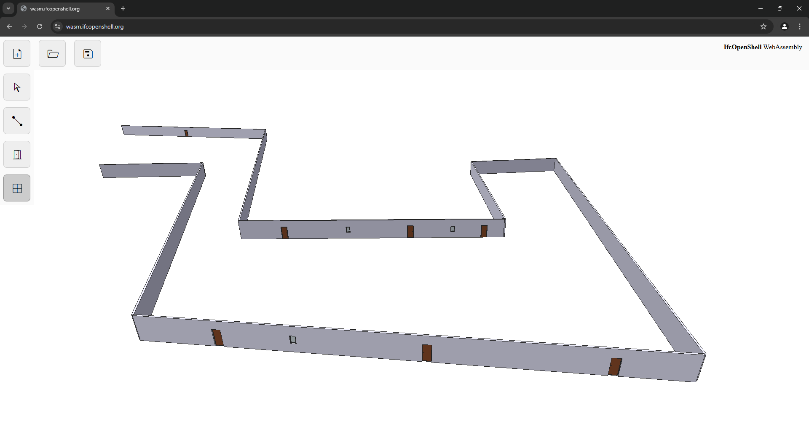
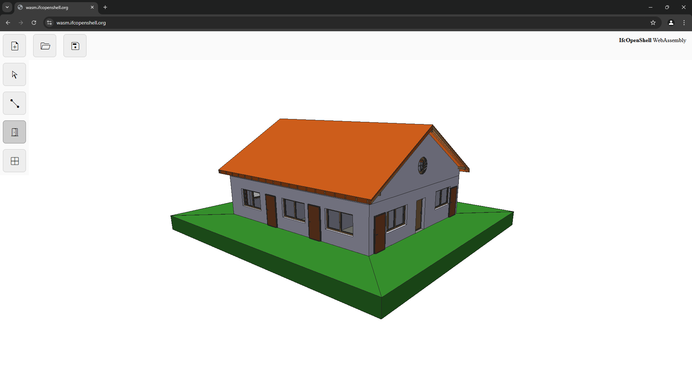

# IfcOpenShell WASM

Live version: http://wasm.ifcopenshell.org

This is a technological preview of an IfcOpenShell WASM python module for use in [pyodide](https://pyodide.org/en/stable/). It uses [emscripten](https://emscripten.org/) to compile the C/C++ (of the python interpreter, IfcOpenShell and its dependencies respectively) into a WebAssembly (WASM) module. WebAssembly can be used in the browser or other JavaScript runtimes such as NodeJS.

## Demo

#### Draw polygonal walls and place door and windows by using the tool panel on the left



#### Open existing .ifc models and improve accessibility by adding doors



#### Save .ifc models and import in any compatible tool


## FAQ

- *Is this some half-baked attempt to compete with Bonsai?*

  By all means no. And, actually, it's the same code under the hood, namely the IfcOpenShell API calls such as `root.create_entity`, `geometry.add_wall_representation` and `geometry.add_window_representation`.

## Approach

This approach of supporting IFC within the browser is rather heavy as it depends on a python interpreter loading the wasm-compiled monolithic IfcOpenShell wheel on demand. But nevertheless, we see this as the most powerful approach of enabling IfcOpenShell in the browser.

Over time, Python code has surpassed C++ as the predominant language in IfcOpenShell and has become the defacto standard for the IfcOpenShell API. We wouldn't want browser-based usage to require duplicating this powerful set of APIs.

Wrapping the full IfcOpenShell-python module results in a feature rich module, that makes for example, IFC validation, visualization, but also **authoring** a breeze because any pre-existing pure python module can be leveraged.

## Technical usage

### Pyodide proxy objects

Allows direct usage of python objects in JavaScript code.

```js
let ifcopenshell_geom = pyodide.pyimport('ifcopenshell.geom');
let s = ifcopenshell_geom.settings();
s.set('weld-vertices', false);
```

### Python code evaluation by Pyodide

Allows running actual python code with the ability for JavaScript to easily reflect on global variables.

```js
pyodide.runPython(`
from context import Context
import numpy as np
modelObject = Context()`);
```

### In-line python code using PyScript

Allows running inline python code in HTML script tags

## Limitations

- Performance of loading and running code is not optimal.
- C++ exception handling in the IfcOpenShell dependencies seems to cause issues in WASM, because the OpenCASCADE failures do not inherit from `std::exception`
